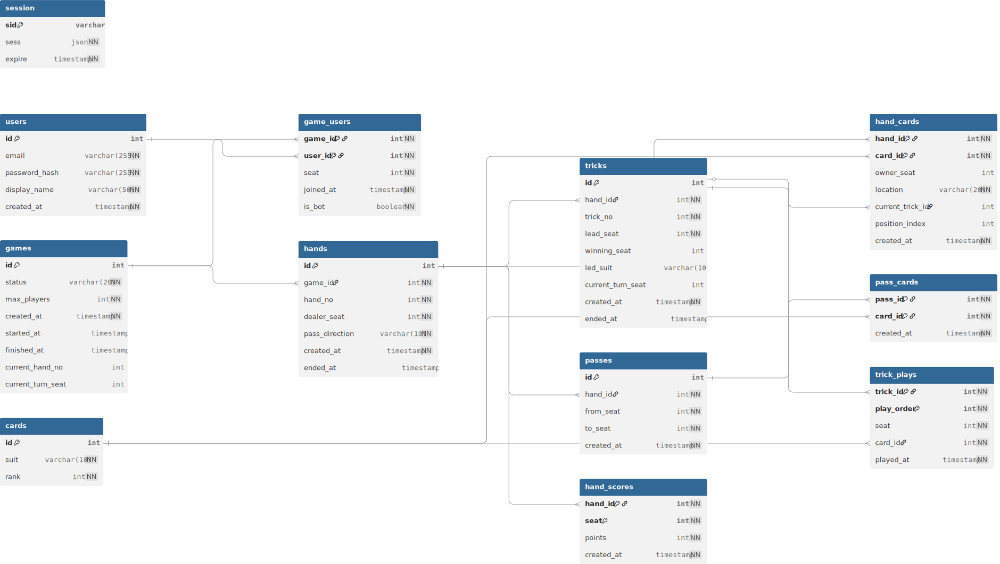

# Database ERD

**CSC 667 Term Project**

- **Last Updated:** 2026-04-02
- **Latest Changes:**
  - removed `games.host_user_id`
  - standardized `game_players` → `game_users`
  - creator/host is now derived from earliest `joined_at` in `game_users`
  - added case-insensitive email index
  - added relationship indexes for performance

This is the reference ERD for the Hearts project.  
The source of truth is `migrations/`.

---

## Full Schema Diagram

